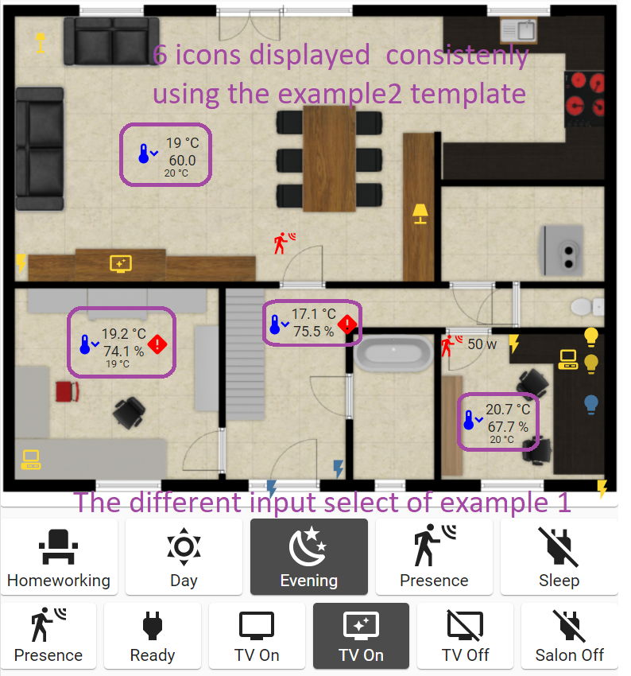

# yaml-builder-for-Home Assistant (HA)

# Description

Batch program in python producing a yaml file in output based on a template. This was created to ease &amp; have consistency when configuring home assistant with YAML but it works in other use cases where you need to compose/build YAML files. 

# Disclaimer
This is my first project sharing on Github and I try to do my best, suggestion/coaching is welcomed.
Code is not bullet-proof (220 lines of code written on a few hours) but it does the job.

# What it could help you to build in HA...

# Features
- Replace a part of a YAML file by inserting a template
- The template rendering engine is Jinja2 (see https://jinja.palletsprojects.com/en/2.11.x/), to replace value, if statement logic etc...
- Possibility to bundle several template into a single file (allowing to group few around a common theme for example)
- Recurcive template processing
- Possibility to pass any custom parameters to the template
- Possibility to pass Home-Assistant objects to the template (if used in HA context of course)

# Command line
python ../yamlbuilder.py inputfile.yaml outputfile.yaml

# Syntax for Command & Parameters inside the templates
Command to add in YAML file (JSON parameters are optional:   
\#include <template.yaml>,<JSON parameters>
The indentation of the ocmmand is very important. The block will be inserted using the same indentation as the command.

 | Keywords  | Type           | Description                                                                   |
 | --------- | -------------- | ------------------------------------------------------------------------------ |
 | #include  | Command        | The command is #include,<template file>, the full content of the template will be incorporated |
 | #block    | JSON Parameter | Can define one of the block inside the template to only incorporate it and not the full yaml file. It works for now on 2 levels | 
 | #jinja    | JSON Parameter | true (default) or false, this allows to disable jinja engine to run on the template |
 | END       | Command        | For debugging purpose, the reading of tthe file just stop if it reads the keywor "END"  |
 

# Example1 - Build automatically 1 automation for each "scene" of a room based on the selection done in a "input_select".
To understand the meaning of the example, you probably need to be knoweldgeable on Homa-Assistant & how its YAML configuraiton works.
In this example, with 10 lines of template + 20 lines of main code, we will generate automatically 200 lines of YAML.
I use this to have a better "semantic" view of my files and this can enforse easily consistency across similar needs (like here all automations uses the same templete, if we change the template you rebuild and have all automations adapted, no risk to forget one update.

You need one template for the automation: template1.yaml
in this case it reprends the "how" a functionality is rendered in native YAML for Home-Assistant
  
**python ../yamlbuilder.py main1.yaml output1.yaml**


 ```
 - id: 'change input select to {{ j.newstate }} for {{ j.inputselect }}'
  alias: 'change input select to {{ j.newstate }} for {{ j.inputselect }}'
  trigger:
    - platform: state
      entity_id: input_select.{{ j.inputselect }}
      to: '{{ j.newstate }}'
  action:
    - service: scene.turn_on
      entity_id: scene.scene_{{ j.room }}_{{ j.newstate }}
      
```
The main file below represents the "what to do" in a more functional way. It does not describe the "how" (this part is managed in the template above).
We pass parameters to the template using a json structure.
The main file for the builder: main1.yaml
```
#-----------------------------------------------------------------------------
# Scene activation based on input option for bureau
#-----------------------------------------------------------------------------
#include template1.yaml,{"newstate":"day"          ,"inputselect": "state_bureau", "room": "bureau"}
#include template1.yaml,{"newstate":"evening"      ,"inputselect": "state_bureau", "room": "bureau"}
#include template1.yaml,{"newstate":"homeworking"  ,"inputselect": "state_bureau", "room": "bureau"}
#include template1.yaml,{"newstate":"sleep_all"    ,"inputselect": "state_bureau", "room": "bureau"}
#include template1.yaml,{"newstate":"sleep_chronos","inputselect": "state_bureau", "room": "bureau"}
#include template1.yaml,{"newstate":"presence"     ,"inputselect": "state_bureau", "room": "bureau"}

#-----------------------------------------------------------------------------
# Scene activation based on input option for living room
#-----------------------------------------------------------------------------
#include template1.yaml,{"newstate":"all_off"      ,"inputselect": "state_salon", "room": "salon"}
#include template1.yaml,{"newstate":"presence"     ,"inputselect": "state_salon", "room": "salon"}
#include template1.yaml,{"newstate":"ready"        ,"inputselect": "state_salon", "room": "salon"}
#include template1.yaml,{"newstate":"tv_on_day"    ,"inputselect": "state_salon", "room": "salon"}
#include template1.yaml,{"newstate":"tv_on_evening","inputselect": "state_salon", "room": "salon"}
#include template1.yaml,{"newstate":"tv_off"       ,"inputselect": "state_salon", "room": "salon"}

```

# Example2 - More advanced
Look into the second example where we use the receive parameters to make some computation to position correctly several icons in a common way
inside a picture-elements.

There is also a g.json allowing to define global parameters (static) or dynamic collection of HA objects.
The static data can be accessed in templete using {{ g.<attribute> }} to get the associated value

If you need to apply a template for all sensor having regex selection on name, you need to define the IP adress of HA
 and provides a bearer token. For now, simply dapt the code at the top of yamlbuilder.yaml

Here below I define static variables (var1, var2) and dynamic lists of objects I extract from HA to allow making loop in my templates
```
{
    "automations" : "(automation.)+",
    "sensors"     : "(sensor.)+",
    "zbatteries"  : "sensor.[0-9a-f]{16}_power",
    "zhumidity"   : "sensor.[0-9a-f]{16}_humidity",
    "ztemperature": "sensor.[0-9a-f]{16}_temperature",
    "var1": "value1",
    "var2": "value2"
}
```
Here below is the template to generate alerts for all "humidity" sensors.
The "zhumidity" collection is defined here-above in the g.json file (using regex expression for selection)

```
###########################################
#
# ALERT
#
###########################################
- platform: template
  sensors:
  
    {{ "  alert_" }}{{ z.entity_id[7:] }}:
      friendly_name:  {{ "\"Alert "}}{{ z.entity_id[7:] }}"
      value_template: {{ "\"{{ 'normal' if states('"}}{{ z.entity_id }}{{"') | float < 70.0 else 'heavy'}}\"" }}
      icon_template: >
        {{ ""}}
          mdi:thumb-up-outline
        {{ " "}}
          mdi:alert-rhombus
        {{ ""}}
  
```

An example that show how to group several templates in a single file using the #block keyword.
You have to typically insert the block1 in a lovelace yaml file and the builder will resolve all this to you...

```
- type: vertical-stack
  cards:
  #include bam_blocks.yaml,{"#block":"2"}
  #include bam_blocks.yaml,{"#block":"4"}

- type: horizontal-stack
  cards:
  
  #include bam_blocks.yaml,{"#block":"3", "bam_entity":"{{zigate.entity_id}}_bam" , "bam_entity_name":"{{zigate.attributes.friendly_name}}", "icon":"mdi:zigbee"}
  
    
- cards:
  type: custom:button-card
  icon: {{j.icon}}
  show_icon: true
  show_name: true
  show_state: flase
  entity: {{ j.bam_entity }}
  name: {{ j.bam_entity_name }}
  state: 
    - value: 'on'
      styles:
        card:
        - background-color: rgb(56,124,68)
    - value: 'home'
      styles:
        card:
        - background-color: rgb(56,124,68)
    - value: 'connected'
      styles:
        card:
        - background-color: rgb(56,124,68)
    - value: 'off'
      styles:
        card:
        - background-color: rgb(255,0,0)
    - value: 'not_home'
      styles:
        card:
        - background-color: rgb(255,0,0)
    - value: 'disconnected'
      styles:
        card:
        - background-color: rgb(255,0,0)


- type: horizontal-stack
  cards:
  #include bam_blocks.yaml,{"#block":"3", "bam_entity":"zigate.zigate" , "bam_entity_name":"Zigate", "icon":"mdi:zigbee"}
  #include bam_blocks.yaml,{"#block":"3", "bam_entity":"device_tracker.am335x_opt" , "bam_entity_name":"Onkyo", "icon":"mdi:amplifier"}
  #include bam_blocks.yaml,{"#block":"3", "bam_entity":"device_tracker.broadlink_rmproplus_d9_9b_ab" , "bam_entity_name":"Broadlink", "icon":"mdi:remote"}
  #include bam_blocks.yaml,{"#block":"3", "bam_entity":"device_tracker.02aa04ac36140mmx","bam_entity_name":"Nest","icon":"mdi:nativescript"}
  #include bam_blocks.yaml,{"#block":"3", "bam_entity":"device_tracker.18_00_30_a2_96_5e","bam_entity_name":"Nest Protect","icon":"mdi:nativescript"}
  #include bam_blocks.yaml,{"#block":"3", "bam_entity":"device_tracker.titan","bam_entity_name":"Titan","icon":"mdi:nas"}
  #include bam_blocks.yaml,{"#block":"3", "bam_entity":"device_tracker.sitan","bam_entity_name":"Garage","icon":"mdi:nas"}
  #include bam_blocks.yaml,{"#block":"3", "bam_entity":"device_tracker.sma","bam_entity_name":"SMA","icon":"mdi:weather-sun"}
```


